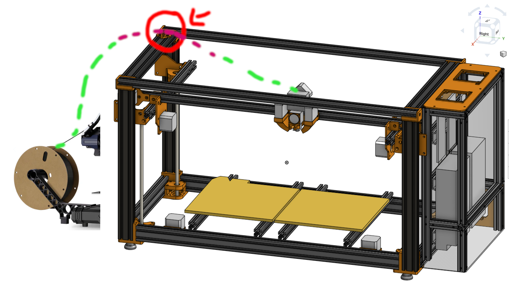
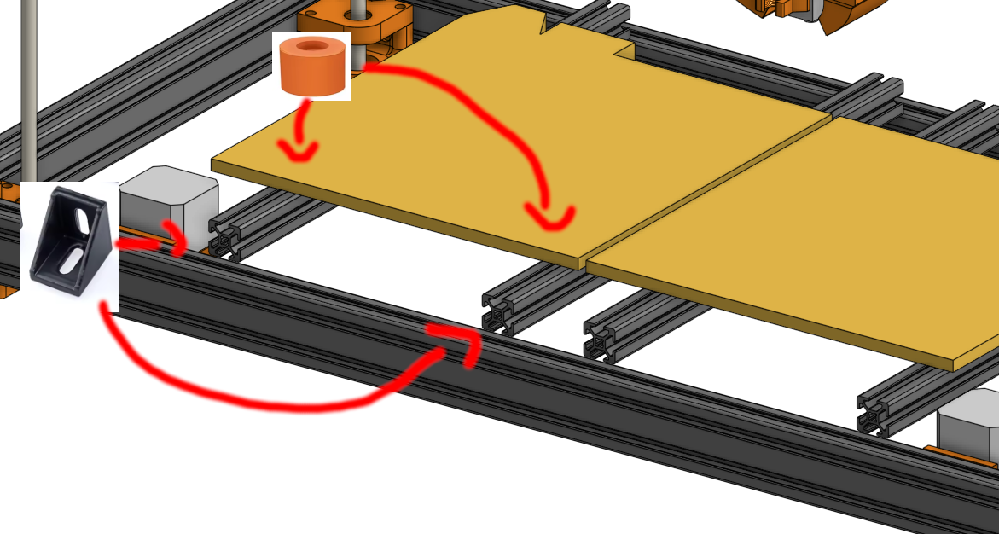
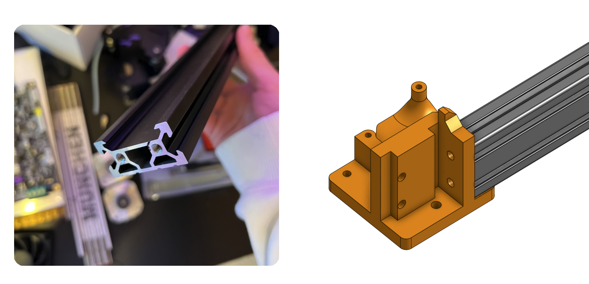
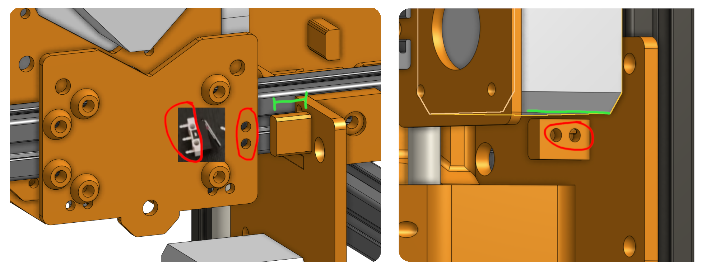

# Design notes

Notes about aspects of the final printer design.

Contents:

- [Filament holder](#filament-holder)
- [Bed mount](#bed-mount)
- [Frame - Bottom corner pieces](#frame---bottom-corner-pieces)
- [Frame - TPU feet](#frame---tpu-feet)
- [Motion - Endstops](#motion---endstops)
- [Frame - Z-Lead screw bottom assembly](#frame---z-leadscrew-bottom-mount)
- [BOM - Screws etc](#bom---screws-etc)

## Filament holder

I'll reuse the original "Filament clip-on holder". I've added a PTFE tube mount to the top of the printer to guide the filament over the top edge and into the printing area:

*I'll add a PTFE tube to the purple section*

## Bed mount

The two heatbeds will be mounted to the vertical aluminum extrusions using the silicon bed spacers, and the vertical extrusions will be mounted to the frame using these 90deg brackets (inspired by the voron 2.4 bed mount, since it can hold the sold aluminum bed, it should be strong enough to hold the cheap pcb heatbed)

## Frame - Bottom corner pieces

The aluminum extrusions will be mounted to the corner pieces using [blind joints](https://docs.vzbot.org/assets/images/manual/blind-joints/blind-joints.png). Additionally the vertical extrusions are being reused from the Kobra printers, and "slide" into the corner pieces (see picture).

## Frame - TPU feet

The feet will be printed with TPU to be flexible and absorb *some* of the vibrations. They'll be screwed into the bottom corner pieces using M5 Screws

## Motion - Endstops

I'll use microswitches as X and dual Y endstops. The Z-Axis will use the ABL sensor. Since I didn't find any accurate measurements of the microswitches, I made the "activator/clicker" (marked in green) a separate part to be easelly modified.

## Frame - Z-Leadscrew bottom mount

Stackup of the bottom assembly:

- Printed top-cover part
- 608 barring
- Printed Spacer
- GT 40T pulley
- 608 barring
- Printed bottom part

## BOM - Screws, etc

I have various screws and other stuff left from the two Kobra printers and the Ender3NG I just build. The BOM only contains the fasteners I'm personally missing to build the printer, not all the required ones!
