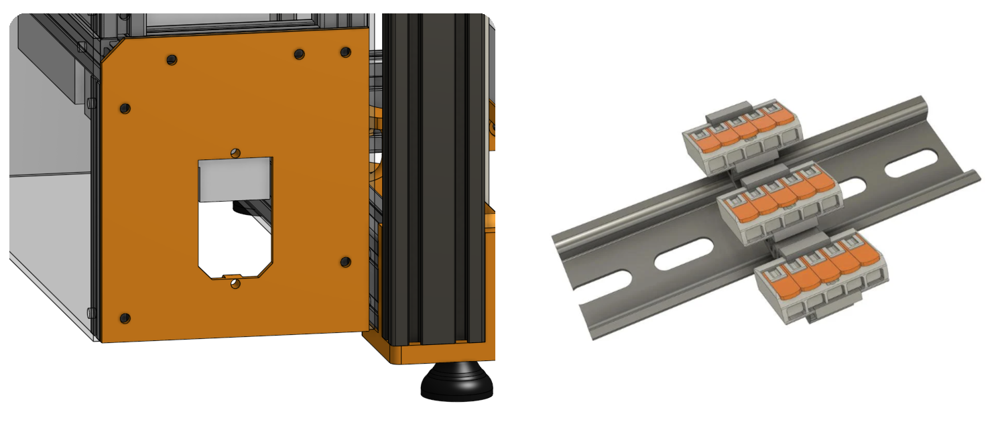
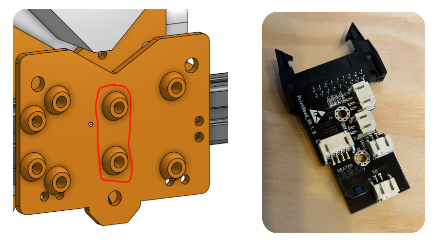

# Design notes

Contents:

- [Filament holder](#filament-holder)
- [Bed mount](#bed-mount)
- [Frame - Bottom corner pieces](#frame---bottom-corner-pieces)
- [Frame - TPU feet](#frame---tpu-feet)
- [Motion - Endstops](#motion---endstops)
- [Frame - Z-Lead screw bottom assembly](#frame---z-leadscrew-bottom-mount)
- [BOM - Screws etc](#bom---screws-etc)
- [BOM - Reuse of parts from Kobras](#bom---reuse-of-parts-from-kobras)
- [Electronics - Mains wiring](#electronics---mains-wiring)
- [Electronics - 2 MBs](#electronics---2-mbs)

## Filament holder

I'll reuse the original "Filament clip-on holder". I've added a PTFE tube mount to the top of the printer to guide the filament over the top edge and into the printing area:

*I'll add a leftover PTFE tube to the purple section*

## Bed mount

The two heatbeds will be mounted to the vertical aluminum extrusions using the silicon bed spacers, and the vertical extrusions will be mounted to the frame using these 90deg brackets (inspired by the voron 2.4 bed mount, since it can hold the sold aluminum bed, it should be strong enough to hold the cheap pcb heatbed)

## Frame - Bottom corner pieces

The aluminum extrusions will be mounted to the corner pieces using [blind joints](https://docs.vzbot.org/assets/images/manual/blind-joints/blind-joints.png). Additionally the vertical extrusions are being reused from the Kobra printers, and "slide" into the corner pieces (see picture).

## Frame - TPU feet

The feet will be printed with TPU to be flexible and absorb *some* of the vibrations. They'll be screwed into the bottom corner pieces using M5 Screws

## Motion - Endstops

I'll use microswitches as X and dual Y endstops. The Z-Axis will use the ABL sensor. Since I didn't find any accurate measurements of the microswitches, I made the "activator/clicker" (marked in green) a separate part to be easelly modified.

## Frame - Z-Leadscrew bottom mount

Stackup of the bottom assembly:

- Printed top-cover part
- 608 barring
- Printed Spacer
- GT 40T pulley
- 608 barring
- Printed bottom part

## BOM - Screws, etc

I have various screws and other stuff left over from the two Kobra printers and the Ender3NG I just build. The BOM only contains the fasteners I'm personally missing to build the printer, not all the required ones to build it from scratch!

## BOM - Reuse of parts from Kobras

This printer reuses various parts from the two Anycubic Kobras. Most notably:

- Heatbeds & Buildplate
- PSUs, MBs, Motors, some Belts, Leadscrew
- Direct drive extruder, Hotend, ABL probe, Wires
- Some aluminum extrusions (all the darker ones in the CAD model are reused)

I **do not** reuse:

- Metal structural parts (plates, etc)
- Plastic structural parts

All orange parts in the CAD modal are self designed and will be 3D printed!

## Electronics - Mains wiring

I'll reuse the mains cable socket with buildin fuse from one of the kobras. I'll then use [this thing:5018395](https://www.thingiverse.com/thing:5018395) to mount 3 Wago 221 connectors to split the incomming mains for the two PSUs.

Each PSU will power one MB, and the right PSU will also be connected to this [step down converter](https://de.aliexpress.com/item/1005007820952595.html?spm=a2g0o.order_list.order_list_main.80.36075c5feb4ZS8&gatewayAdapt=glo2deu) to produce 5V for the rpi zero.

## Electronics - 2 Controller boards / MBs

Since this printer uses two Control boards (MBs) with only 4 stepper drivers each I need to split the 6 steppers between them.

The first board will only control the two Z-Steppers and one heatbed.  
The second board will control the two Y-Steppers, the one X-Stepper, the extruder, the hotend and one heatbed.

This shouldn't cause any problems, since the Z-Axis is the slowest and least used axis, and any possible delay between the two MBs shouldn't really matter.

I'll cut holes and slots into the acrylic backplate to make place for the stepper motor, etc. cables.

## Electroics - Toolhead breakout board

I'll reuse the original toolhead breakout board and mount it to the new toolhead. The breakout board connects the ABL probe, heater,  thermistor, fans and extruder stepper using a 18-Pin IDC cable to MBs.

