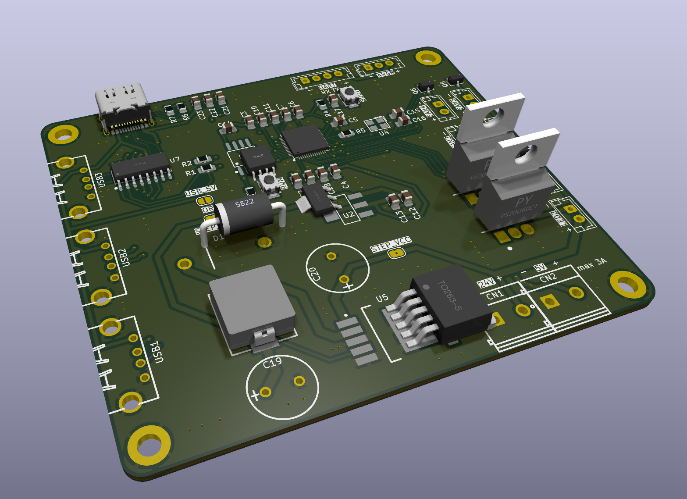
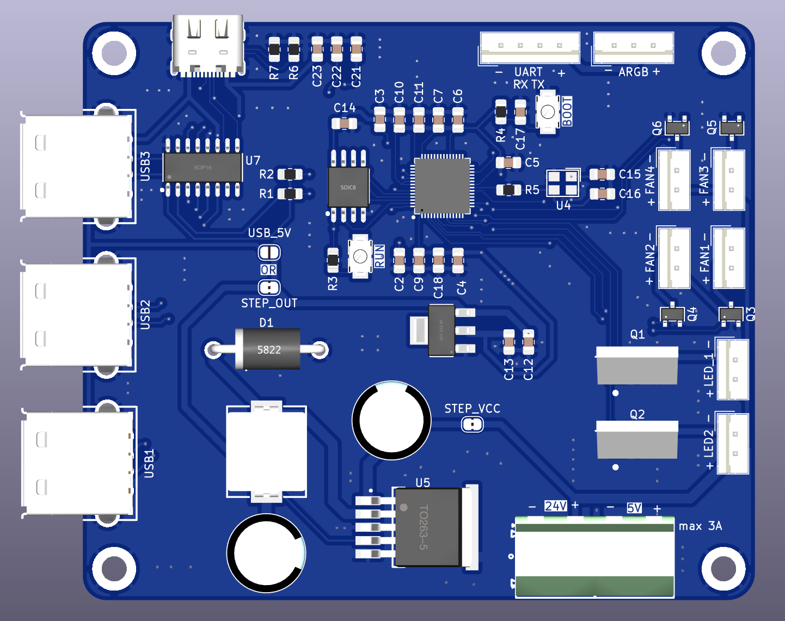
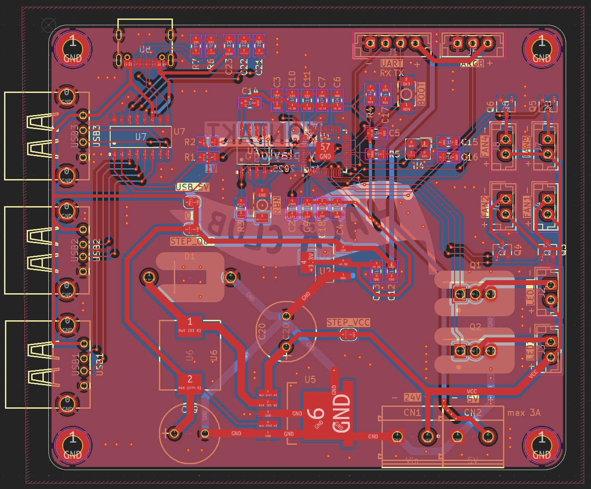
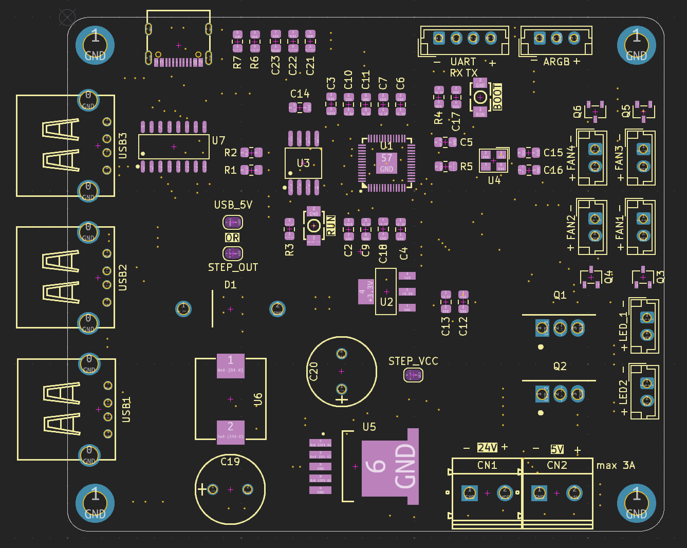

# Kontakt - Fan & LED control board

|  | |
| ---------------------------------------|------------------------------------|
|  |  |

Features:

- 24V power input
- Build-in 5V 3A Stepdown (for RP2040 and external RPI)
- RP2040 with 128MB Flash
- 3 Port USB hub
- 1x UART connection
- 1x ARGB connection
- 2x High current 24V PWM outputs (5A)
- 4x Low current 24V PWM outputs (2A)

Why ?: I originally only wanted to slap a rpi pico onto a pcb and add 6 mosfets to it, but like you can see I got sidetracked and added my own rp2040 (my first one!), a step-down converter (also a first) and a USB hub...

It'll be used to control the fans inside the electronics enclosure and connect the 2 control boards to the one usb port of the RPI Zero 2w, which it will also power. The high current PWM outputs are for eventual LED bar upgrades, which might or might not happen.

Firmware: I'll be using Klipper on the RP2040 with [this extension module](https://github.com/julianschill/klipper-led_effect) to control the Neopixel

Schematic: [Here](../files/schematic.pdf)

Libraries:

- [easyeda2kicad](https://github.com/uPesy/easyeda2kicad.py), needs to be installed separately, used for downloading LCSC schematics & footprints
  - Run `easyeda2kicad --full --lcsc_id=<id>` to download each component (one-by-one, yes...)

## Components

LCSC IDs:

- C2040 - RP2040
- C26537 - LDO
- C778164 - 2x Button
- C113767 - SPI Flash
- C20625731 - Crystal
- C7429053 - High current mosfet
- C5364313 - Low current mosfet
- C10002 - LM2596 3A Step down - [datasheet](https://www.lcsc.com/datasheet/lcsc_datasheet_2410010301_Texas-Instruments-LM2596SX-5-0-NOPB_C10002.pdf)
  - L1: 47uH L39 - C7529419
  - Cout: 330uF/35V - C242140
  - D1: C7503125
  - Cin: 680uF/35V - C178718
- C2915639 - Screw terminal
- C2988369 - USB C Female connector
- C192893 - USB Hub chip
- C503996 - USB Female plug

Resistors & Capacitors

- 10K C5140188
- 5.1k C26023
- 1k C17513
- 27.4ohm C2079437

- 100nF C29926
- 1uF C541528
- 10uF C1713
- 15pF C5186731

> I've got enough JST XH connectors in stock.

## BOM

### PCB

JLCPCB: $3.20 (LeadFree HASL) + $1.50 (shipping) = $4.70

### Parts

> Note: Since this is my first time soldering a rp2040 (QFN-* package in general), I've added enough parts to build 2 board, so that I can mess one up, and if I manage to get both working I can also use it for the Ender3NG :D

| LCSC ID   | Name                          | Amount      | Total price | Need if combined order ? |
|-----------|-------------------------------|-------------|-------------|--------------------------|
| C2040     | RP2040                        | 2x          | 2.25        | Yes                      |
| C26537    | LDO                           | MOQ (5)    | $ 1.36     | Yes                      |
| C778164   | 2x Button                     | MOQ (5)    | $ 0.46     | No                       |
| C113767   | SPI Flash                     | 2x         | $ 1.18     | Yes                      |
| C20625731 | Crystal                       | 2x         | $ 0.75     | Yes                      |
| C7429053  | High current mosfet           | 4x         | $ 2,54     | Yes                      |
| C5364313  | Low current mosfet            | MOQ(10)    | $ 0.46     | Yes                      |
| C10002    | LM2596 3A Step down           | 2x         | $ 1.84     | Yes                      |
| C7529419  | LM2596 3A Step down (L1)       | 2x         | $ 0.74     | Yes                      |
| C242140   | LM2596 3A Step down (Cout)     | MOQ (5)    | $ 1.32     | Yes                      |
| C7503125  | LM2596 3A Step down (D1)       | MOQ (5)    | $ 0.4      | Yes                      |
| C178718   | LM2596 3A Step down (Cin)      | 2x         | $ 0.9      | Yes                      |
| C2915639  | Screw terminal                | MOQ (5)    | $ 0.91     | Yes                      |
| C2988369  | USB C Female connector        | MOQ (5)    | $ 0.39     | No                       |
| C192893   | USB Hub chip                  | MOQ (5)    | $ 1.25     | No                       |
| C503996   | USB Female plug               | MOQ (10)   | $ 0.41     | No                       |
| C5140188  | 10K                           | MOQ (100)  | $ 0.13     | No                       |
| C26023    | 5.1k                          | MOQ (100)  | $ 0.15     | No                       |
| C17513    | 1k                            | MOQ (100)  | $ 0.17     | No                       |
| C2079437  | 27.4ohm                       | MOQ(50)    | $ 0.38     | Yes                      |
| C29926    | 100nF                         | MOQ(50)    | $ 0.29     | No                       |
| C541528   | 1uF                           | MOQ(50)    | $ 0.95     | No                       |
| C1713     | 10uF                          | MOQ(20)    | $ 0.18     | No                       |
| C5186731  | 15pF                          | MOQ(100)   | $ 0.69     | Yes                      |

- Shipping: $ 10.05

Combined order with Hackpad & Board: $16.07 (2 tires - saved shipping & fewer components)  
Enough parts for one try: $25.06  
Enough parts for two tries: $30.00

### Total

- PCB: $4.70 (even cheaper shipping if combined with LCSC order!)
- Parts: $16.07 (combined with hackpad & board, 2 tries)

Total: $20.07
