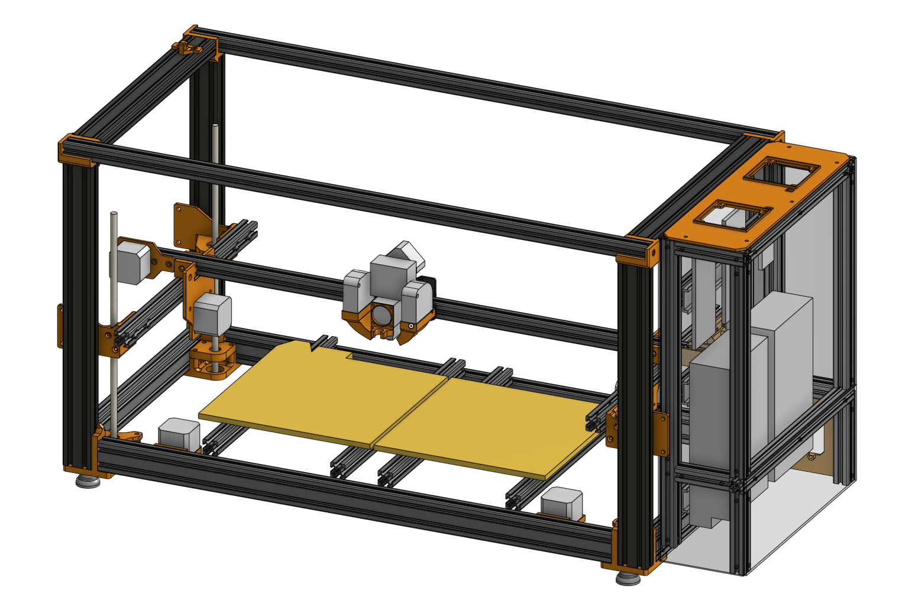

# Billig - A 3D printer from Scratch

> *Designing a 3D printer from scratch in 5 days*

**Bom**: [Google sheets](https://docs.google.com/spreadsheets/d/1451xPwitG2cd0BywjLuyT1Flae_F1tCVU7JKSqZtRoc/edit?usp=sharing)  
**CAD**: [Onshape](https://cad.onshape.com/documents/d0a1f0aa5ccbfda89a60ed00/w/724bd13dc87be16ac72aafeb/e/c63896b50a2324a549602fe6?renderMode=0&uiState=67f44fca4d37325097df6c3a)

About the printer:

- 440x230x260mm printing volume
- 940x410x465mm frame
- Reuses a lot of parts from two "broken" [Anycubic Kobra 2 Neos](https://de.anycubic.com/products/kobra-2-neo)
- Direct drive extruder & dual 5020 part cooling
- Completely enclosed electronics
- Build-in ABL & Nozzle offset sensor
- With a rpi zero & Klipper-Ready
- ~$330 (including the two broken printers)

Take a look at the [Journal](JOURNAL.md) or the [Design notes](notes.md)!
